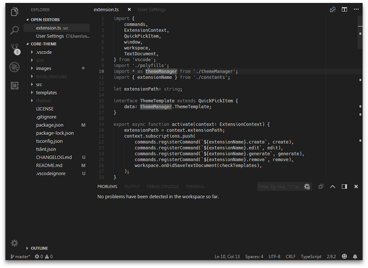
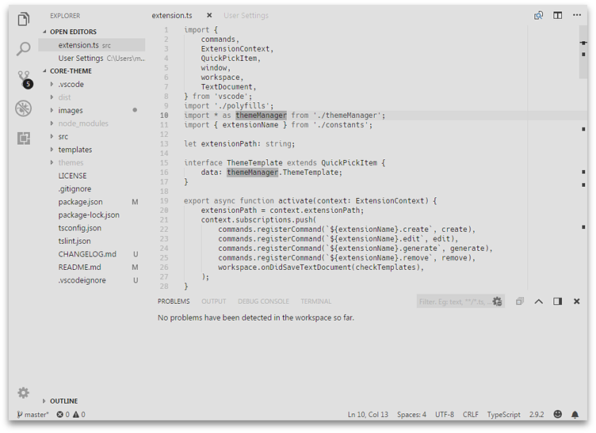

A configurable [Visual Studio Code][vscode] theme with minimal environment
aesthetics for maximum focus.

[][vsmarketplace]

## Overview

This extension provides you with two default themes which change colours used
by the base editor UI and syntax highlighting. It also provides commands that
enable you to create or manage custom theme variants.

The themes aim to be genuinely minimal. This no-frills approach means that some
editor features (e.g. many distinct colours prescribed in the overview ruler)
are intentionally crippled in an effort to reduce visual noise. A limited
offering of colours and decorations can help by concentrating your focus
on the content you write.

The themes are also monochromatic in nature. Users with colour blindness
should hopefully not have a degraded experience using them.

## Screenshots

### Core (Dark)

The default dark theme bundled with this extension.



### Core (Light)

The default light theme bundled with this extension.



## Usage

After installing this extension through the Visual Studio Marketplace,
simply invoke the _Command Palette_ (e.g. <kbd>F1</kbd>), find the
_Preferences: Color Theme_ option, select it, then scroll through the
available theme options to find either _Core (Dark)_ or _Core (Light)_ and
make a final selection to have the theme applied.

Beyond the default themes, you can tinker around with custom theme management
commands included with this extension, which are described below.

### Commands

Using the _Command Palette_, you can find the following options:

- _Core Theme: Create Template_
- _Core Theme: Edit Template_
- _Core Theme: Remove Template_
- _Core Theme: Generate Themes_

This extension is capable of automatically generating theme files from
a custom template format. Underneath the hood, the extension takes two
colour inputs and interpolates them to a broader set of colours which
then forms the basis for a custom theme variant.

If you use the _Core Theme: Create Template_ option, you should see a new
file open up with contents somewhat similar to the following:

```json
{
  "name": "My Theme",
  "backgroundColor": "#000000",
  "foregroundColor": "#ffffff"
}
```

After picking and saving your colour options, the extension should prompt
you to update the collection of generated themes. If not, you can always
manually use the _Core Theme: Generate Themes_ option. Thereafter, you should
be able to choose your custom theme variant using _Preferences: Color Theme_.

### Adjustments

If any parts of the default or generated custom themes are not to your liking,
you can always use the `workbench.colorCustomizations` setting to tweak
UI-related colours, or `editor.tokenColorCustomizations` to tweak the
syntax highlighting. [Here is documentation for these settings.][color-ref]

[color-ref]: https://code.visualstudio.com/docs/getstarted/theme-color-reference
[vscode]: https://code.visualstudio.com/
[vsmarketplace]: https://marketplace.visualstudio.com/items?itemName=miqh.core-theme
