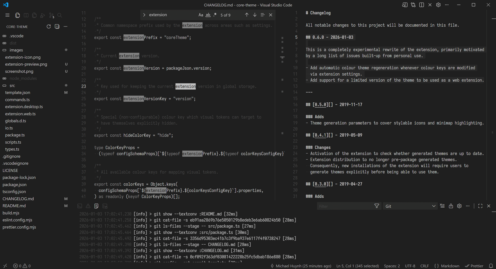

# Core Theme

A [Visual Studio Code] extension that provides a configurable colour theme.
It strives to minimise colour variation and visual clutter for maximum focus.

(Preview capture also uses [Core Icon Theme].)

[Core Icon Theme]: https://github.com/miqh/vscode-core-icon-theme
[Visual Studio Code]: https://code.visualstudio.com/

## Features

- The colour set for syntax highlighting is distilled down to four rough
  categories: keywords, literals, documentation (comments) and catch-all for
  everything else. Having a fifth for types (names) would be great, but the
  TextMate grammar approach to providing colouring scopes is limited in how
  accurate it can be. If semantic highlighting is available, the theme should
  take advantage of that for better accuracy of what it does cover.
- With all remaining visual elements, colours have been assigned manually
  and as parsimoniously as possible. Many items are also deliberately hidden,
  particularly those that are predominantly decorative in nature. Some care
  has also been taken as to not completely cripple an editor feature by
  occluding or blending visual elements into ambiguity.
- Colour assignments can be customised using the colour keys setting
  (`coreTheme.colorKeys`) available in the settings section for this extension.
  Assigning invalid colour key values, or leaving them empty, will result in
  strange visuals. The canonical list of colour keys may change later.

> [!NOTE]
> This theme is available as a web extension, but it loses the ability to be
> configured, thus only the default colour key settings shipped will apply.

## Notes

- The `coreTheme.updateTemplate` command is only available in development
  builds of the extension and is used for tracking any new tokens targeting
  new visual elements in future VS Code versions.
